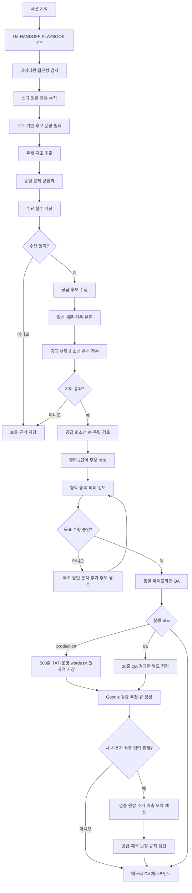

# Claude Code 프로젝트 통합 설계서  
## 고수요·저공급 SaaS 기회 발굴 및 영어 2단어 제목 생성 시스템

- 문서 버전: v2.4
- 작성일: 2026-08-03
- 시간대: Asia/Seoul
- GitHub 저장소: `https://github.com/daramg814/SAAS_WORDS_TWO.git`
- 기본 브랜치: `main`
- 핵심 목표: 최소 수요가 실제로 확인된 문제 중 공급 부족이 가장 심한 SaaS 기회를 우선 발굴하고, 한 번의 제목 생성 실행마다 최종 승인된 신규 영어 2단어 제목을 정확히 500개 생성한다.
- 설계 방향: 토큰 사용을 줄이기 위해 데이터 수집·정리·중복 제거·점수 계산은 코드로 처리하고, Claude Code는 문제 의미 해석과 최종 기회 판단에만 사용한다. 운영 실행은 최종 500개를 생성하고, QA 실행은 동일한 전체 파이프라인에서 목표 수량만 20개로 낮춘다. 사용자가 시간 날 때 일부 Google 검색 결과를 입력하면 이를 장기 검증 자산으로 누적해 공급 예측과 제목 충돌 예측을 보정한다.

---

# 1. 작업 컨텍스트

## 1.1 배경

단순히 그럴듯한 영어 단어 두 개를 조합하면 실제 사용 가치가 낮은 제목이 대량 생성될 수 있다. 본 프로젝트는 먼저 공개 데이터에서 실제 업무 수요가 존재하는 문제를 찾고, 그 문제를 해결하는 기존 제품이 실제로 얼마나 존재하는지 확인한다. 이후 수요 규모가 조금 작더라도 공급이 훨씬 부족한 문제를 우선하여 SaaS 제목을 생성한다.

Google Keyword Planner와 Google Trends는 필수 데이터원에서 제외한다. API 승인, 사용량 제한, 인증 만료, 자동화 불안정성과 봇 차단 가능성에 의존하지 않기 위해 공식 공개 API, 공개 데이터 덤프, 공개 아카이브와 로컬 분석만 사용한다.

## 1.2 목적

1. 실제 사용자가 반복적으로 겪는 SaaS화 가능한 문제를 찾는다.
2. 해당 문제의 직접·부분·범용 공급 제품을 구분한다.
3. 수요 점수와 공급 부족 점수를 계산한다.
4. 최소 수요 기준을 통과한 문제를 공급 부족 등급 순으로 우선 정렬한다.
5. 공급 부족이 심한 기회부터 영어 2단어 제목 후보를 생성한다.
6. 한 번의 제목 생성 실행마다 검증을 통과한 신규 제목 정확히 500개를 확보한다.
7. 과거 생성 제목과 중복되지 않는 신규 제목만 저장한다.
8. 실행을 반복해도 세션을 이어갈 수 있고, 의미 있는 이슈와 노하우를 재사용한다.
9. 사용자가 일부 시장 검색어와 생성 제목을 Google에서 직접 확인한 결과를 영구 저장하고, AI 예측 오차를 줄이는 교정 데이터로 사용한다.

## 1.3 핵심 원칙

> AI 판정은 **현재 실행 중인 Claude Code 세션 또는 해당 세션이 호출한 서브에이전트**가 직접 수행하며, 별도로 `anthropic` 패키지를 호출하거나 API 키를 설정할 필요가 없다.

- 검색량이 아니라 실제 문제를 표현한 독립 사용자와 반복성을 수요의 핵심으로 본다.
- 공급량은 검색 결과 수가 아니라 동일 사용자의 동일 문제를 해결하는 활성 제품 수로 계산한다.
- 수요는 시장 존재 여부를 확인하는 최소 관문으로 사용하고, 최종 우선순위는 공급 부족을 더 크게 반영한다.
- 수요 점수가 낮더라도 실제 반복 문제와 경제적 손실이 확인되고 직접 공급이 거의 없으면 상위 기회로 올릴 수 있다.
- 단, 수요 증거가 사실상 없는 문제는 공급이 0개여도 시장 부재 가능성으로 제외한다.
- Google 검색 결과 페이지 스크래핑, CAPTCHA 우회, 브라우저 자동화는 사용하지 않는다.
- 모든 원문을 LLM에 전달하지 않는다. 코드가 후보 문장만 추려서 전달한다.
- 처음부터 모든 데이터원을 사용하지 않는다. 접근성 QA를 통과한 데이터원만 단계적으로 활성화한다.
- 한 번의 제목 생성 실행은 최종 승인된 신규 제목 정확히 500개를 생성해야 완료된다. 후보 생성량은 고정하지 않고 승인 결과에 따라 자동 확대한다.
- 고정된 다수 서브에이전트 대신 최소 에이전트 구조를 사용한다.

## 1.4 포함 범위

- 공개 데이터원 접근성 검사
- 수요 관련 게시글·질문·댓글 증분 수집
- 문제 문장 추출과 동일 문제 군집화
- 수요 점수 계산
- 제품 후보 수집과 활성 제품 검증
- 공급 유형 분류와 공급 부족 점수 계산
- 기회 점수와 신뢰도 산정
- 영어 2단어 제목 생성
- 형식·정확 중복·역순 중복·의미 중복 검사
- 실행별 TXT와 전체 누적 TXT 저장
- 세션 인수인계, 이슈·노하우, 품질 추세, Git 체크포인트

## 1.5 제외 범위

- 시장 전체 규모나 매출의 확정 계산
- 비공개 기업 내부 수요 조사
- 유료 데이터 구매
- Google Keyword Planner·Google Trends 의존
- 무차별 웹 크롤링
- CAPTCHA·로그인·봇 차단 우회
- 도메인 구매 가능성 확정
- 상표권 법률 의견 확정
- 실제 SaaS 제품 구현

## 1.6 성공 기준

- 수요 문제마다 근거 원문과 출처가 연결된다.
- 수요 통과 문제는 독립 사용자 5명 이상, 최근 24개월 사례, 수작업 또는 기존 제품 불만, 구매 의도 또는 경제적 손실을 가진다.
- 공급 제품은 직접·부분·범용·비경쟁으로 구분된다.
- 최종 기회는 수요 점수 45 이상, 공급 부족 점수 65 이상, 희소성 우선 점수 65 이상, 신뢰도 A 또는 B를 만족한다.
- 최종 제목은 영어 알파벳 2단어, Title Case, 한 줄 한 제목 형식이다.
- 제목 생성 실행 1회당 최종 승인 제목 수는 정확히 500개다.
- 500개를 채우지 못한 실행은 완료로 처리하거나 최종 파일을 게시하지 않는다.
- 실행별 제목은 `/output/generated/saas_words_YYYYMMDD_HHMMSS_KST.txt`에 저장한다.
- 전체 누적 제목은 `/output/history/words.txt`에 저장한다.
- `words.txt`와 현재 실행 내부에 정확 중복이 없다.
- 코드나 설계 변경 후 사용자와 동일한 진입점·처리 단계·검증 로직을 사용하는 축소 수량 QA가 PASS한다.
- QA 기본 목표는 최종 승인 제목 20개이며, 운영 목표 500개와 동일한 코드 경로를 사용한다.
- 중단된 세션은 `HANDOFF.md`와 Run 상태를 읽고 마지막 검증 지점부터 재개한다.

## 1.7 실패 기준

- 데이터 근거 없이 문제를 고수요로 판정함
- 단순 URL 수를 공급량으로 계산함
- 접근성 검증을 통과하지 못한 데이터원에 의존함
- 제목이 2단어 규칙 또는 중복 규칙을 위반함
- 최종 승인 제목이 500개 미만인데 실행을 완료로 처리함
- 누적 파일이 부분 기록되거나 손상됨
- 세션 재개 시 이전 상태를 잃음
- Git 푸시 실패
- 일부 행만 입력된 사용자 검증 파일
- 같은 검증 행 중복 가져오기
- 잘못된 결과 수·날짜·validation_id
- 동일 검색어의 다른 날짜 관측
- Google 결과 수는 높지만 관련 제품 수가 낮은 노이즈 사례
- 공급 과소추정과 공급 과대추정 사례
- TITLE_QUERY가 시장 공급 점수에 잘못 반영되지 않는지
- 사람 검증이 없는 산업에 보정이 과도하게 전파되지 않는지 후 다음 작업을 진행함
- QA가 실제 사용자 진입점이 아닌 별도 축약 경로만 검사함

---

# 2. 입력과 출력

## 2.1 입력

| 경로 | 형식 | 역할 |
|---|---|---|
| `/config/project.yaml` | YAML | 데이터원, 기간, 점수 기준, 운영 목표 500개, QA 목표 20개 등 실행 설정 |
| `/config/sources.yaml` | YAML | 데이터원 엔드포인트와 활성 상태 |
| `/input/brief.md` | Markdown | 목표 시장, 제외 시장, 언어 등 선택 설정 |
| `/input/blocklist.txt` | UTF-8 TXT | 금지 단어와 금지 제목 |
| `/input/human_google_checks.csv` | UTF-8 CSV | 사용자가 일부 검색어의 Google 표시 결과 수를 입력하는 선택 파일 |
| `/output/review/google_validation_queue.csv` | UTF-8 CSV | 사람이 확인하면 학습 가치가 높은 검색어 추천 목록 |
| `/output/history/words.txt` | UTF-8 TXT | 과거 전체 승인 제목 |
| `/memory/PROJECT_PLAYBOOK.md` | Markdown | 검증된 간단한 운영 노하우 |
| `/memory/HANDOFF.md` | Markdown | 현재 Run과 다음 작업 |

입력이 없으면 광범위한 B2B·B2C SaaS 문제를 대상으로 한다.

## 2.2 실행 모드

| 모드 | 목표 승인 수 | 출력 위치 | 운영 누적 파일 반영 |
|---|---:|---|---|
| `production` | 500개 | `/output/generated/` | 반영 |
| `qa` | 기본 20개 | `/output/qa/` | 반영하지 않음 |

두 모드는 동일한 진입점과 동일한 코드 경로를 사용한다. 차이는 설정으로 전달되는 `target_title_count`, 출력 루트와 운영 파일 반영 여부뿐이다.

예시 설정 개념:

```yaml
execution_mode: production
target_title_count: 500

qa:
  target_title_count: 20
  output_root: output/qa
  update_production_history: false
```

QA 전용 축약 구현이나 별도 제목 생성 코드는 만들지 않는다.

## 2.3 핵심 출력

### 실행별 신규 제목

```text
/output/generated/saas_words_YYYYMMDD_HHMMSS_KST.txt
```

규칙:

- UTF-8
- LF 줄바꿈
- 한 줄에 제목 하나
- 정확히 영어 단어 2개
- 단어 사이 공백 하나
- 숫자·기호·하이픈 금지
- 현재 실행에서 승인된 신규 제목만 포함
- 정상 완료 파일은 정확히 500줄이어야 함
- 500개 미만의 결과는 `/output/intermediate/`에만 저장하고 최종 파일로 게시하지 않음

### 전체 누적 제목

```text
/output/history/words.txt
```

- 모든 과거 승인 제목을 한 줄에 하나씩 저장
- 임시 파일 작성 후 원자적 교체
- 현재 실행 결과와 정확히 일치하는 증가분 검증

### QA 출력

```text
/output/qa/<qa_run_id>/
├── generated/saas_words_qa.txt
├── opportunities.jsonl
├── qa_report.md
├── qa_history_snapshot.txt
└── logs/
```

QA 결과는 운영용 `/output/generated/`와 `/output/history/words.txt`에 반영하지 않는다. QA 시작 시 운영 `words.txt`의 읽기 전용 스냅샷을 사용해 중복 검사는 동일하게 수행한다.

### 사용자 Google 검증 출력

```text
/output/review/google_validation_queue.csv
/output/review/google_feedback_import_report.md
/memory/human_feedback/google_supply_observations.jsonl
/memory/human_feedback/google_calibration_metrics.json
/memory/human_feedback/google_query_playbook.md
```

`google_validation_queue.csv`는 사용자가 반드시 전부 처리해야 하는 작업 목록이 아니다. 사용자는 시간 날 때 원하는 행만 검색하고 결과를 `/input/human_google_checks.csv`에 입력한다. 입력된 행은 다음 실행에서 자동 반영되며, 미입력 행은 계속 대기하거나 새 우선순위에 따라 교체될 수 있다.

### 기회 데이터

```text
/output/final/opportunities.jsonl
```

필수 필드:

```json
{
  "problem_id": "P-0001",
  "target_user": "small construction firms",
  "task": "track contractor insurance expiration",
  "workaround": "email and spreadsheets",
  "pain": "missed renewals",
  "demand_score": 78,
  "supply_scarcity_score": 72,
  "opportunity_score": 76,
  "confidence": "A",
  "decision": "GENERATE_TITLES",
  "evidence_ids": ["E-001", "E-002"],
  "product_ids": ["S-001", "S-002"]
}
```

---

# 3. 데이터원 정책

## 3.1 기본 데이터원

### Hacker News 공식 API

용도:

- Ask HN의 문제·도구 추천 질문
- 일반 게시글과 댓글의 반복 업무 불만
- Show HN의 제품 공급 후보

특징:

- JSON
- API 키·로그인 불필요
- 마지막 수집 ID 이후만 증분 수집
- 원문은 로컬 DB에 저장하고 AI에는 후보 문장만 전달

기본 상태: `ENABLED`

## 3.2 선택 데이터원

다음 데이터원은 실제 Claude Code PC에서 접근성 시험을 통과한 경우에만 활성화한다.

| 데이터원 | 용도 | 활성 조건 |
|---|---|---|
| Stack Exchange 선택 사이트 덤프 | 장기간 반복 문제와 질문 | 파일 다운로드·7z 해제·XML 파싱 PASS |
| GH Archive 최근 30~90일 | 기능 요청·수작업·내부 스크립트 문제 | `.json.gz` 다운로드·해제·필터 PASS |
| Common Crawl | 이미 확보한 제품 도메인의 기능·가격·활성 상태 확인 | 인덱스 조회·부분 레코드 다운로드 PASS |
| npm Registry | 개발자 도구·오픈소스 대체재 공급 보조 | JSON 메타데이터·검색 PASS |
| 공식 RSS·Atom | 특정 산업의 공개 문제·공지 | 고정 피드 URL과 증분 수집 PASS |

## 3.3 접근성 테스트

프로젝트 최초 실행과 데이터원 설정 변경 시 다음을 수행한다.

```text
1. 최소 샘플 다운로드
2. 응답 형식 확인
3. 압축 해제 또는 JSON 파싱
4. 필요한 필드 추출
5. 디스크 사용량 확인
6. 재실행 시 중복 다운로드 방지 확인
7. 결과를 access_test_report.md에 기록
```

실패한 데이터원은 자동으로 `DISABLED` 처리하며 전체 파이프라인은 가능한 데이터원만으로 계속한다. 단, 독립 출처가 부족하면 결과 신뢰도를 낮춘다.

---

# 4. 사용자 Google 검증 자산화

## 4.1 목적

자동 데이터만으로 계산한 공급량은 제품의 다른 명칭, 검색 누락, 오픈소스 대체재와 산업별 용어 차이 때문에 틀릴 수 있다. 사용자가 일부 항목을 직접 Google에서 확인한 결과를 입력하면 다음 두 가지를 교정한다.

1. `MARKET_QUERY`: 특정 SaaS 문제의 온라인 공급 노출 규모 보정
2. `TITLE_QUERY`: 생성된 영어 2단어 제목의 기존 사용·충돌 가능성 보정

두 검색은 의미가 다르므로 반드시 구분한다.

예:

```text
MARKET_QUERY:
"vendor insurance tracking software"

TITLE_QUERY:
"Vendor Guard"
```

`MARKET_QUERY` 결과는 공급 부족 예측을 보정한다. `TITLE_QUERY` 결과는 제목 신규성·혼잡도·브랜드 충돌 위험을 보정하며 시장 공급량 계산에는 직접 사용하지 않는다.

## 4.2 사용자가 입력하는 방식

프로젝트는 다음 파일을 자동 생성한다.

```text
/output/review/google_validation_queue.csv
```

권장 열:

| 열 | 설명 |
|---|---|
| `validation_id` | 검증 항목 고유 ID |
| `query_type` | `MARKET_QUERY` 또는 `TITLE_QUERY` |
| `problem_id` | 연관 SaaS 문제 ID |
| `title` | 연관 생성 제목, 없으면 공란 |
| `google_query` | 사용자가 그대로 복사해 검색할 문구 |
| `predicted_effective_supply` | AI가 추정한 유효 공급량 |
| `predicted_scarcity_score` | AI의 공급 부족 점수 |
| `predicted_result_band` | AI가 예상한 Google 결과 규모 구간 |
| `priority_reason` | 이 검증이 학습에 유용한 이유 |
| `user_result_count` | 사용자가 입력하는 Google 표시 결과 수 |
| `user_checked_at` | 검색한 현지 날짜·시간 |
| `country` | 검색 국가, 기본 `KR` |
| `language` | 검색 언어, 기본 `ko` 또는 검색 문구 언어 |
| `search_context` | 일반·시크릿·로그인 등 선택 기록 |
| `top_results_relevant` | 선택 항목. 첫 결과 일부에서 관련 SaaS로 보인 개수 |
| `user_notes` | 선택 메모 |

사용자는 전체 행을 처리할 필요가 없다. 검색한 행만 채워 `/input/human_google_checks.csv`로 저장한다. 프로젝트는 새 입력 행만 자동 감지한다.

최소 필수 입력:

```text
validation_id
user_result_count
user_checked_at
```

권장 입력:

```text
top_results_relevant
user_notes
```

Google 표시 결과 수는 대략적인 값이고 지역·언어·날짜·로그인 상태에 따라 달라질 수 있으므로 검색 문구와 관찰 조건을 함께 보존한다.

## 4.3 검증 대상 추천 방식

사람의 시간을 가장 가치 있게 사용하기 위해 모든 제목을 요청하지 않는다. `google_validation_queue.csv`에는 다음 항목을 우선 추천한다.

1. 공급 희소성 `S`등급인데 AI 신뢰도가 낮은 시장 검색어
2. 공급 부족 점수와 발견 제품 수가 서로 모순되는 문제
3. 최종 500개 중 높은 점수를 받았지만 제목 충돌 위험이 불확실한 제목
4. 이전 사람 검증에서 AI 오차가 컸던 산업·표현과 유사한 항목
5. 아직 사람 검증 데이터가 없는 산업군
6. 같은 의미의 검색어 중 AI 예측 차이가 큰 항목
7. 향후 점수 기준을 바꿀 가능성이 큰 경계값 항목

추천 목록은 산업·문제·제목 패턴이 한쪽으로 편중되지 않도록 다양성 제한을 적용한다.

기본 권장 목록:

```text
MARKET_QUERY 20개
TITLE_QUERY 30개
합계 최대 50개
```

이는 의무 작업량이 아니라 선택 가능한 추천 목록이다.

## 4.4 append-only 검증 원장

가져온 사람 검증 데이터는 다음 파일에 한 줄씩 추가한다.

```text
/memory/human_feedback/google_supply_observations.jsonl
```

예시:

```json
{
  "observation_id": "HGO-20260804-0001",
  "validation_id": "GVQ-20260804-0012",
  "query_type": "MARKET_QUERY",
  "problem_id": "P-0042",
  "title": null,
  "google_query": "\"vendor insurance tracking software\"",
  "user_result_count": 18400,
  "user_checked_at": "2026-08-04T20:15:00+09:00",
  "country": "KR",
  "language": "en",
  "search_context": "normal",
  "top_results_relevant": 7,
  "predicted_effective_supply_at_time": 1.8,
  "predicted_scarcity_score_at_time": 91,
  "predicted_result_band_at_time": "LOW",
  "source": "human_manual_google",
  "import_run_id": "RUN-20260804-003"
}
```

원칙:

- 기존 관측치를 수정하거나 덮어쓰지 않는다.
- 같은 검색어를 다른 날짜에 다시 검사하면 새 관측치로 추가한다.
- 완전히 동일한 `validation_id + result_count + checked_at`만 중복으로 거부한다.
- AI 예측값은 입력 시점의 값을 함께 동결 저장해 나중에 과거 예측 오차를 재현한다.
- 원문 CSV가 삭제되어도 JSONL 원장은 유지한다.
- Git에는 개인정보가 없는 검증 원장과 요약 지표만 저장한다.

## 4.5 Google 결과 수의 정규화

Google 결과 수는 실제 제품 개수가 아니며 매우 큰 범위를 가진다. 원시 숫자를 그대로 공급량에 더하지 않고 다음처럼 정규화한다.

```text
google_footprint = log10(user_result_count + 1)
```

그 후 `query_type`, 검색 문구 형태, 언어, 산업군별 누적 관측치 안에서 백분위로 변환한다.

```text
footprint_percentile = 같은 조건 관측치 중 상대적 위치
```

초기 데이터가 부족할 때는 고정 구간을 임시 사용한다.

| 표시 결과 수 | 임시 footprint 등급 |
|---:|---|
| 0~99 | 매우 낮음 |
| 100~999 | 낮음 |
| 1,000~9,999 | 중간 |
| 10,000~99,999 | 높음 |
| 100,000 이상 | 매우 높음 |

이 구간은 실제 관측 데이터가 30건 이상 쌓이면 프로젝트 자체 백분위 기준으로 교체한다.

`top_results_relevant`가 입력된 경우에는 표시 결과 수보다 더 높은 신뢰도를 부여한다. 표시 결과가 많더라도 상위 결과에서 관련 SaaS가 거의 없으면 검색 노이즈로 분류한다.

## 4.6 AI 예측과 사람 관측 비교

AI는 검증 큐를 생성할 때 다음을 미리 예측한다.

```text
predicted_result_band:
VERY_LOW
LOW
MEDIUM
HIGH
VERY_HIGH
```

사람 입력 후 실제 footprint 등급과 비교해 오차를 기록한다.

| 비교 결과 | 오차 유형 |
|---|---|
| 실제 등급이 예측보다 2단계 이상 높음 | `SUPPLY_UNDERESTIMATED` |
| 실제 등급이 예측보다 2단계 이상 낮음 | `SUPPLY_OVERESTIMATED` |
| 결과 수는 높지만 관련 SaaS 비율이 낮음 | `QUERY_NOISE_HIGH` |
| 결과 수는 낮지만 관련 SaaS 비율이 높음 | `NICHE_COMPETITION_DENSE` |
| 예측과 관측이 유사 | `CALIBRATED` |

`TITLE_QUERY`에는 별도 오차 유형을 사용한다.

| 비교 결과 | 제목 오차 유형 |
|---|---|
| 예상보다 결과가 매우 많음 | `TITLE_COLLISION_UNDERESTIMATED` |
| 예상보다 결과가 매우 적음 | `TITLE_COLLISION_OVERESTIMATED` |
| 상위 결과에 동일 제품·브랜드 존재 | `TITLE_BRAND_CONFLICT` |
| 일반 단어 조합만 많고 제품 충돌 없음 | `TITLE_GENERIC_PHRASE` |
| 결과가 적고 직접 충돌 없음 | `TITLE_CLEAR` |

## 4.7 공급 점수 보정

사람 입력 하나로 자동 공급 점수를 크게 뒤집지 않는다. 보정은 누적 표본 수와 일관성에 따라 제한적으로 적용한다.

문제별 사람 검증 신뢰도:

```text
human_weight =
min(0.25, valid_market_observations / 20 × 0.25)
```

- 관측 1건: 최대 1.25% 반영
- 관측 5건: 최대 6.25% 반영
- 관측 10건: 최대 12.5% 반영
- 관측 20건 이상: 최대 25% 반영

보정 개념:

```text
adjusted_supply_scarcity =
base_supply_scarcity × (1 - human_weight)
+ human_google_scarcity × human_weight
```

단, `top_results_relevant`가 없고 표시 결과 수만 입력된 관측은 최대 반영 비중을 절반으로 제한한다.

```text
표시 결과 수만 있음: 최대 12.5%
관련 결과 수까지 있음: 최대 25%
```

사람 검증이 공급 과소추정을 반복적으로 보여주면 다음을 자동 수행한다.

- 해당 산업의 공급 동의어 확장
- 공급 검색어 템플릿 추가
- Common Crawl·HN·GitHub 공급 후보 재조사
- `S`등급을 일시 보류하고 재검증
- 공급 누락 이슈 생성

사람 검증이 공급 과대추정을 반복적으로 보여주면 다음을 수행한다.

- 검색 노이즈를 만드는 일반 단어를 검색식에서 제외
- 직접·부분·범용 제품 분류 기준 재검토
- 범용 도구 가중치 축소 실험
- 희소성 점수 복원 가능성 검토

## 4.8 제목 충돌 점수 보정

`TITLE_QUERY` 결과는 공급 부족 점수와 분리해 제목 품질 점수에 반영한다.

제목별 추가 필드:

```text
google_title_footprint
google_title_collision_class
human_title_validation_count
title_collision_adjustment
```

기본 처리:

- 정확한 따옴표 검색 결과가 매우 적고 동일 제품이 없으면 신규성 가점
- 결과가 많아도 일반 문장·인명·비제품 사용만 있으면 중립
- 동일 SaaS·앱·회사명이 상위 결과에 있으면 강한 감점 또는 탈락
- 사용자가 메모로 직접 충돌을 표시하면 `TITLE_BRAND_CONFLICT`로 즉시 재검토

Google 결과 수만으로 상표권 사용 가능성을 확정하지 않는다. 이 데이터는 이름 혼잡도와 추가 조사 우선순위를 정하는 용도로만 사용한다.

## 4.9 누적 자기개선

매 실행 후 다음 지표를 갱신한다.

```text
전체 사람 검증 수
MARKET_QUERY 검증 수
TITLE_QUERY 검증 수
산업별 검증 수
공급 과소추정률
공급 과대추정률
제목 충돌 과소추정률
검색식별 노이즈율
사람 검증 전후 공급 등급 변경 수
사람 검증으로 탈락한 제목 수
```

저장 위치:

```text
/memory/human_feedback/google_calibration_metrics.json
```

검증 데이터가 충분히 쌓이면 다음 항목을 학습 자산으로 승격한다.

- 산업별 공급 검색 동의어
- 검색 노이즈가 낮은 검색식
- 공급 과소추정이 자주 발생하는 시장 유형
- 제목 충돌이 잦은 단어 조합
- Google footprint와 실제 발견 제품 수의 경험적 관계
- 사람 검증이 필요한 우선순위 규칙

검증된 규칙은 다음에 반영한다.

```text
/memory/human_feedback/google_query_playbook.md
/memory/PROJECT_PLAYBOOK.md
/config/project.yaml
/scripts/collect_supply_candidates.py
/scripts/score_opportunities.py
/scripts/dedupe_titles.py
```

## 4.10 편향 방지

사용자는 임의로 일부 항목만 검사하므로 사람이 선택한 표본이 전체 시장을 대표한다고 가정하지 않는다.

반드시 다음을 지킨다.

- 사람 검증 데이터가 없는 산업에 기존 보정값을 무리하게 전파하지 않는다.
- 검증한 항목과 비슷한 산업·검색식에만 보정을 우선 적용한다.
- 사람 검증 여부를 신뢰도 필드에 명시한다.
- 검증 표본 수가 적으면 `PROVISIONAL` 상태로 유지한다.
- 공급 점수 보정 상한은 25%로 제한한다.
- 단일 관측치로 점수 기준, 에이전트 지침 또는 플레이북을 영구 변경하지 않는다.
- 동일 규칙이 최소 5건 이상에서 반복되고 QA를 통과해야 검증 노하우로 승격한다.

## 4.11 처리 상태

| 상태 | 의미 |
|---|---|
| `QUEUED` | 사용자 검증 추천 목록에 포함 |
| `PARTIALLY_FILLED` | 일부 필드만 입력됨 |
| `IMPORTED` | 원장에 정상 반영됨 |
| `DUPLICATE_REJECTED` | 동일 관측 중복 |
| `INVALID` | 숫자·날짜·ID 형식 오류 |
| `PROVISIONAL` | 표본이 적어 임시 보정만 적용 |
| `CALIBRATED` | 충분한 검증으로 보정 규칙 확립 |
| `RESEARCH_REQUIRED` | AI 예측과 사람 관측 차이가 커서 공급 재조사 필요 |

---

# 5. 최소 에이전트 구조

## 4.1 선택 근거

토큰 사용량을 줄이기 위해 상시 다중 에이전트 구조를 사용하지 않는다. 대부분의 작업은 메인 에이전트와 스크립트가 수행하고, 최종 기회와 제목만 독립 검토한다.

## 4.2 에이전트

| 에이전트 | 역할 | 호출 시점 |
|---|---|---|
| `main-orchestrator` | 문제 추출, 의미 군집, 수요·공급 해석, 제목 생성, 전체 상태 조율 | 전체 실행 |
| `opportunity-reviewer` | 점수 상위 기회의 수요·공급 근거와 최종 제목 독립 검토 | 기회 점수 계산 후 |
| `final-qa-runner` | 사용자와 동일한 진입점으로 전체 파이프라인 실행 | 게시 전, 코드·문서 변경 후 |
| `session-handoff-manager` | 현재 상태와 다음 작업을 짧게 정리 | 배치 완료·세션 종료 전 |
| `human-feedback-calibrator` | 사용자 Google 검증 입력의 의미 해석, 오차 유형 판정과 보정 규칙 후보 검토 | 새 사람 입력 반영 시 |

이슈 정리와 노하우 정리는 별도 상시 에이전트를 호출하지 않는다. 스크립트가 후보를 기록하고, 메인 에이전트가 실제 재발 가능성이나 측정 가능한 개선이 있는 경우에만 문서를 갱신한다.

서브에이전트 간 직접 호출은 금지한다. 모든 전달은 `main-orchestrator`를 통하며 큰 데이터는 파일 경로만 전달한다.

---

# 6. 판단과 코드 역할 분리

| 업무 | 처리 방식 | 담당 에이전트 | 담당 스크립트 |
|---|---|---|---|
| 사용자 검증 큐 생성 | 코드+LLM | main-orchestrator | `build_google_validation_queue.py` |
| 사용자 CSV 가져오기 | 코드 | 결과 검토: human-feedback-calibrator | `import_human_google_checks.py` |
| Google 관측 정규화 | 코드 | 해당 없음 | `normalize_google_feedback.py` |
| AI 예측 오차 유형 판정 | LLM+코드 | human-feedback-calibrator | `calibrate_supply_predictions.py` |
| 공급·제목 점수 보정 | 코드 | 결과 해석: human-feedback-calibrator | `apply_human_calibration.py` |
| 데이터 다운로드 | 코드 | 해당 없음 | `collect_sources.py` |
| 압축 해제·파싱 | 코드 | 해당 없음 | `parse_sources.py` |
| 후보 문장 필터 | 코드 | 결과 검토: main-orchestrator | `filter_pain_sentences.py` |
| 문제 의미 추출 | LLM | main-orchestrator | 형식 검증 |
| 동일 문제 의미 군집 | 코드+LLM | main-orchestrator | `cluster_problems.py` |
| 독립 사용자·기간 집계 | 코드 | 해당 없음 | `score_demand.py` |
| 손실·구매 의도 판단 | LLM | main-orchestrator | 점수 합산 |
| 제품 후보 수집 | 코드 | 해당 없음 | `collect_supply_candidates.py` |
| 활성 제품 검증 | 코드+LLM | main-orchestrator | `verify_products.py` |
| 직접·부분·범용 분류 | LLM | main-orchestrator | 점수 합산 |
| 희소성 우선 점수·등급 계산 | 코드 | 결과 해석: main-orchestrator | `score_opportunities.py` |
| 공급 희소성 순 독립 기회 검토 | LLM | opportunity-reviewer | 해당 없음 |
| 2단어 제목 생성 | LLM | main-orchestrator | 형식 검증 |
| 정확·역순 중복 | 코드 | 해당 없음 | `dedupe_titles.py` |
| 의미 중복·명확성 | LLM | opportunity-reviewer | 해당 없음 |
| 출력 저장 | 코드 | 해당 없음 | `publish_outputs.py` |
| 인수인계 | LLM+코드 | session-handoff-manager | `update_handoff.py` |
| Git 저장 | 코드 | 결과 확인: main-orchestrator | `git_checkpoint.py` |
| QA | 독립 LLM+코드 | final-qa-runner | `run_pipeline_qa.py --mode qa --target-count 20` |

---

# 7. 수요 예측 파이프라인

## 6.1 원문 수집

Hacker News에서 신규 게시글·댓글을 증분 수집한다. 선택 데이터원은 접근성 PASS 시 지정 기간만 수집한다.

성공 기준:

- 응답 파싱 성공
- 중복 ID 없음
- 마지막 수집 지점 저장
- 원문과 메타데이터가 로컬 DB에 저장

검증:

- JSON/XML 스키마
- 다운로드 건수
- 중복 키
- 체크섬

실패 처리:

- 3회 지수 백오프
- 계속 실패하면 데이터원 비활성화
- 다른 데이터원으로 계속 진행
- 독립 출처 부족 시 신뢰도 하향

## 6.2 후보 문제 문장 필터

코드는 다음 표현을 포함하는 문장을 우선 선별한다.

```text
is there a tool
what do you use
how do you manage
still use spreadsheets
built this internally
takes hours
manual process
nothing works well
too expensive
too complicated
would pay for
missing integration
feature request
workaround
```

광고·제품 홍보·코드 블록·인용문·복제 글은 제거한다.

성공 기준:

- 전체 원문보다 LLM 전달량이 크게 줄어듦
- 근거 원문 ID가 유지됨
- 광고·복제 비율이 기준 이하

## 6.3 문제 구조 추출

메인 에이전트는 후보 문장에서 다음을 추출한다.

```text
사용자
반복 업무
현재 처리 방법
불편
영향
원하는 결과
업무 빈도
구매 의도
```

SaaS로 해결하기 어렵거나 일회성 개인 문제는 제외한다.

## 6.4 동일 문제 군집화

문자열 유사도와 공통 명사·동사로 1차 군집화하고, 애매한 군집만 AI가 판단한다.

같은 대상으로 보이더라도 기능이 다르면 분리한다.

예:

- 문서 생성
- 문서 수집
- 문서 진위 확인
- 문서 만료 알림

성공 기준:

- 한 문제군 안에서 사용자·업무·원하는 결과가 일치
- 서로 다른 문제를 과도하게 합치지 않음
- 각 군집에 근거 ID가 유지됨

## 6.5 수요 점수

| 항목 | 배점 |
|---|---:|
| 독립 사용자 수 | 25 |
| 여러 기간에 걸친 지속성 | 15 |
| 업무 빈도 | 10 |
| 시간·비용·오류·규정 위험 | 15 |
| 수작업 증거 | 10 |
| 도구 추천·가격·유료 대안 등 구매 의도 | 15 |
| 독립 데이터원 수 | 10 |
| 합계 | 100 |

통과 조건:

```text
수요 점수 >= 45
독립 사용자 >= 5
최근 24개월 사례 존재
수작업 또는 기존 제품 불만 존재
구매 의도 또는 경제적 손실 존재
```

수요 점수는 기회를 제거하는 강한 순위 기준이 아니라, 실제 시장이 존재하는지 확인하는 최소 관문으로 사용한다. 수요 점수가 45~64점이어도 공급 부족이 매우 심하면 우선 검토 대상으로 유지한다.

---

# 8. 공급 예측 파이프라인

## 7.1 공급 후보 수집

수요를 통과한 문제만 조사한다.

수집 우선순위:

1. 같은 문제군의 Show HN 제품
2. 원문 댓글에서 언급된 제품과 대안
3. GH Archive·GitHub에서 확인된 제품·오픈소스 도구
4. 개발자 문제일 경우 npm 패키지
5. 후보 도메인이 확보된 경우 Common Crawl로 기능·가격·활성 상태 보강

Common Crawl 전체에서 제품을 막연히 검색하지 않는다.

## 7.2 제품 중복 제거

다음은 하나의 제품으로 합친다.

- 같은 회사의 여러 도메인
- 리브랜딩 전후
- 국가별 사이트
- 무료·유료 버전
- 파트너 재판매

중복 키:

```text
정규화 제품명
대표 도메인
모회사
핵심 제품 URL
```

## 7.3 활성 제품 검증

다음 중 3개 이상을 만족해야 활성 공급으로 인정한다.

- 공식 제품명
- 대상 사용자
- 핵심 기능
- 가입·데모·다운로드 경로
- 가격 또는 유료 플랜
- 최근 활동·릴리스·공지
- 실제 제품 문서나 화면
- 고객 사례

블로그, 뉴스, 템플릿, 컨설팅, 대기목록, 폐업 제품은 공급에서 제외한다.

## 7.4 공급 유형 분류

| 유형 | 정의 | 가중치 |
|---|---|---:|
| 직접 | 같은 사용자·같은 문제·같은 결과를 바로 해결 | 1.0 |
| 부분 | 일부 단계만 해결하거나 추가 도구 필요 | 0.4 |
| 범용 | 설정하면 가능하지만 문제 전용 제품이 아님 | 0.1 |
| 비경쟁 | 블로그·교육·컨설팅·관련 없음 | 0 |

```text
유효 공급량 =
직접 제품 × 1.0
+ 부분 제품 × 0.4
+ 범용 도구 × 0.1
```

## 7.5 공급 부족 점수

| 항목 | 배점 |
|---|---:|
| 유효 공급량이 적음 | 40 |
| 특정 사용자 전용 제품 부족 | 20 |
| 강력한 기존 제품 부재 | 15 |
| 최근 24개월 신규 공급 부족 | 10 |
| 기존 제품의 반복 미해결 불만 | 15 |
| 합계 | 100 |

유효 공급량 점수:

| 유효 공급량 | 점수 |
|---:|---:|
| 0~2 | 40 |
| 2 초과~5 | 30 |
| 5 초과~10 | 15 |
| 10 초과 | 0 |

공급 부족 통과 조건:

```text
공급 부족 점수 >= 65
강력한 직접 경쟁 제품 다수 없음
기존 제품의 미해결 공백 또는 사용자 특화 부족 존재
```

## 7.6 공급 희소성 등급

최종 우선순위는 공급 부족 점수만으로 평탄하게 정렬하지 않고, 유효 공급량과 직접 경쟁 제품 수를 함께 사용해 등급화한다.

| 등급 | 조건 | 우선순위 |
|---|---|---|
| `S` | 유효 공급량 0~2, 직접 경쟁 0~2, 공급 부족 점수 80 이상 | 최우선 |
| `A` | 유효 공급량 2 초과~5, 공급 부족 점수 70 이상 | 높음 |
| `B` | 유효 공급량 5 초과~10, 공급 부족 점수 65 이상 | 보통 |
| `C` | 공급 부족 점수 65 미만 또는 강력한 경쟁 다수 | 제목 생성 제외 |

같은 등급 안에서는 희소성 우선 점수, 신뢰도, 수요 점수 순으로 정렬한다.

---

# 9. 공급 희소성 우선 기회 판정

## 8.1 희소성 우선 점수

수요보다 공급 부족에 더 큰 가중치를 부여한다.

```text
기본 점수 =
수요 점수 × 0.35
+ 공급 부족 점수 × 0.65
```

극단적으로 공급이 부족한 문제에는 추가 보너스를 부여한다.

| 조건 | 희소성 보너스 |
|---|---:|
| 유효 공급량 0~2 | +10 |
| 유효 공급량 2 초과~5 | +5 |
| 유효 공급량 5 초과 | +0 |

```text
희소성 우선 점수 =
min(100, 기본 점수 + 희소성 보너스)
```

예시:

```text
문제 A: 수요 80, 공급 부족 60
기본 점수 = 80×0.35 + 60×0.65 = 67
보너스 없음
최종 = 67

문제 B: 수요 52, 공급 부족 90, 유효 공급량 1.5
기본 점수 = 52×0.35 + 90×0.65 = 76.7
희소성 보너스 +10
최종 = 86.7
```

따라서 수요가 조금 적더라도 실제 수요가 존재하고 공급이 거의 없는 문제 B가 먼저 선택된다.

## 8.2 신뢰도

- `A`: 데이터원 3개 이상, 독립 사용자 25명 이상, 공급 제품 페이지 직접 검증
- `B`: 데이터원 2개 이상, 독립 사용자 5명 이상, 일부 공급 검증 완료
- `C`: 단일 데이터원 또는 공급 상태 불확실

## 8.3 제목 생성 조건

```text
수요 점수 >= 45
공급 부족 점수 >= 65
희소성 우선 점수 >= 65
공급 희소성 등급 S, A 또는 B
신뢰도 A 또는 B
실제 수작업 증거 존재
구매 의도 또는 경제적 손실 존재
```

다만 다음은 공급이 0개여도 제외한다.

```text
독립 사용자 5명 미만
최근 24개월 사례 없음
반복 업무가 아님
경제적 손실·시간 손실·위험 증거 없음
SaaS로 해결할 명확한 기능이 없음
```

## 8.4 최종 정렬 순서

기회는 다음 순서로 정렬한다.

```text
1. 공급 희소성 등급: S → A → B
2. 공급 부족 점수 내림차순
3. 유효 공급량 오름차순
4. 희소성 우선 점수 내림차순
5. 신뢰도: A → B
6. 수요 점수 내림차순
```

즉, 수요 점수는 최소 시장 존재를 확인한 뒤의 보조 정렬 기준이다.

## 8.5 검토 판정

`opportunity-reviewer`는 점수 상위 기회만 독립 검토한다.

- 공급 누락 가능성이 낮고 조건을 충족하면 `GENERATE_TITLES`
- 공급 조사가 부족하면 `RESEARCH_MORE`
- 실제 수요가 없거나 강력한 경쟁 제품이 다수면 `REJECT`
- 수요는 낮지만 공급이 극도로 부족하고 반복 손실이 확인되면 `SCARCITY_PRIORITY`

`C` 등급은 제목을 생성하지 않고 추가 조사 대상으로 저장한다.

---

# 10. 영어 2단어 제목 생성

## 9.1 실행 목표

운영 실행은 최종 승인된 신규 제목 정확히 500개를 확보해야 완료된다. QA 실행은 동일한 코드 경로를 사용하되 기본 목표를 20개로 낮춘다.

```text
production 목표: 500개
qa 기본 목표: 20개
최종 파일 줄 수: target_title_count와 정확히 일치
부분 결과 게시: 금지
과거 words.txt 중복: 0개
현재 실행 내부 중복: 0개
역순 중복: 0개
```

후보 생성량은 500개로 제한하지 않는다. 형식 오류, 중복, 의미 중복, 유명 제품명 충돌로 탈락할 것을 고려해 후보를 여러 차례 생성한다.

기본 생성 전략:

```text
1차 후보 수 = max(target_title_count × 1.6, target_title_count + 20)
검증 후 부족분 계산
2차 후보: 부족분 × 2
3차 이후: 부족분 × 2
최대 생성 라운드: 5회
```

예를 들어 운영 모드에서 1차 검증 후 340개만 승인되면 부족분 160개의 두 배인 320개를 추가 생성한다. QA 모드 목표가 20개이면 1차 후보는 기본 40개를 생성한다.

하나의 기회 문제에서 제목을 과도하게 생성하지 않는다. 승인된 제목 500개가 여러 고수요·저공급 기회에 분산되도록 한다.

권장 분산 기준:

- 최소 5개 이상의 승인된 SaaS 기회 사용
- 한 기회가 최종 500개의 30%를 초과하지 않음
- 기회 수가 충분하면 공급 희소성 등급과 희소성 우선 점수에 비례해 제목 수를 배정
- 기회가 부족하면 추가 기회 조사 단계로 돌아감

## 9.2 핵심 개념 추출

기회별 핵심 개념을 추출한다.

- 대상 사용자
- 업무 대상
- 핵심 행동
- 원하는 결과
- 방지할 위험

조합 구조:

```text
대상 + 기능
업무 + 도구
문제 + 해결
결과 + 기능
위험 + 방지
정보 + 관리
```

예:

```text
Vendor Guard
Expiry Relay
Permit Flow
Claim Tracker
Audit Radar
Roster Sync
```

하드 리젝트:

- 정확히 2단어가 아님
- 영문자 외 문자 포함
- 지나치게 추상적
- 어떤 SaaS인지 추측 불가
- 유명 서비스와 명백히 동일
- `words.txt` 정확 중복
- 단어 순서만 바꾼 역순 중복
- 현재 실행 내부 중복

의미 중복과 명확성 검사는 최종 후보만 `opportunity-reviewer`가 수행한다.

## 9.3 500개 확보 반복

각 검증 라운드 후 다음을 계산한다.

```text
승인 수
탈락 수
부족 수 = 500 - 승인 수
기회별 승인 편중률
중복 탈락률
의미 중복 탈락률
```

승인 수가 `target_title_count` 미만이면 다음 순서로 반복한다.

1. 기존 승인 제목은 고정한다.
2. 부족분과 탈락 원인을 분석한다.
3. 동일 패턴 반복을 피하도록 생성 전략을 수정한다.
4. 부족분의 2배만큼 추가 후보를 생성한다.
5. 전체 승인 후보와 합쳐 다시 중복·의미 검사를 수행한다.
6. 승인 수가 목표에 도달하면 점수가 높은 순으로 정확히 `target_title_count`개만 선택한다.

최대 5회 라운드 후에도 목표 수량을 확보하지 못하면:

- 상태를 `RETRYING`으로 유지한다.
- 부족 원인이 기회 부족이면 수요·공급 조사 단계로 복귀한다.
- 부족 원인이 제목 다양성 부족이면 단어 조합 전략을 변경한다.
- 부분 결과는 `/output/intermediate/`에 저장한다.
- 실행별 최종 TXT와 `words.txt`는 갱신하지 않는다.
- 같은 전략을 반복하지 않도록 `HANDOFF.md`에 실패 전략을 기록한다.

## 9.4 최종 목표 수량 선택

`target_title_count`를 초과해 승인된 경우 다음 순서로 정확히 목표 수량만 선택한다.

1. 기회 점수
2. 제목 명확성
3. 의미 다양성
4. 기회별 편중 방지
5. 과거 제목군과의 거리
6. 발음과 기억 용이성

선택 후 `validate_outputs.py`가 다음을 검증한다.

```text
정확히 target_title_count줄
모든 줄이 영어 2단어
빈 줄 없음
정확 중복 없음
대소문자 정규화 중복 없음
역순 중복 없음
blocklist 위반 없음
words.txt 기존 제목과 중복 없음
```

---

# 11. 워크플로우와 상태 전이



표준 상태:

`RUNNING`, `RETRYING`, `CAPABILITY_STAGNATION`, `COMMIT_PENDING`, `RECOVERY_REQUIRED`, `PAUSED`, `FAILED`, `DONE`.

세션 한계는 `DONE`이 아니다. 현재 배치를 검증하고 인수인계·커밋·푸시 후 `PAUSED`로 저장한다.

---

# 12. 폴더 구조

```text
/project-root
├── CLAUDE.md
├── .claude
│   ├── settings.json
│   ├── skills
│   │   ├── source-access/SKILL.md
│   │   ├── demand-analysis/SKILL.md
│   │   ├── supply-analysis/SKILL.md
│   │   ├── title-generation/SKILL.md
│   │   ├── project-memory/SKILL.md
│   │   ├── git-checkpoint/SKILL.md
│   │   └── pipeline-qa/SKILL.md
│   └── agents
│       ├── main-orchestrator/AGENT.md
│       ├── opportunity-reviewer/AGENT.md
│       ├── human-feedback-calibrator/AGENT.md
│       ├── session-handoff-manager/AGENT.md
│       └── final-qa-runner/AGENT.md
├── config
│   ├── project.yaml
│   └── sources.yaml
├── input
│   ├── brief.md
│   ├── blocklist.txt
│   └── human_google_checks.csv
├── data
│   ├── raw
│   ├── cache
│   └── local.db
├── output
│   ├── generated
│   ├── final
│   ├── intermediate
│   ├── runs
│   ├── logs
│   ├── qa
│   ├── review
│   │   ├── google_validation_queue.csv
│   │   └── google_feedback_import_report.md
│   └── history
│       ├── words.txt
│       └── words.normalized.txt
├── memory
│   ├── KNOWLEDGE_MANIFEST.yaml
│   ├── HANDOFF.md
│   ├── ACTIVITY_LOG.jsonl
│   ├── ACTIVE_ISSUES.md
│   ├── PROJECT_PLAYBOOK.md
│   ├── QUALITY_TRENDS.jsonl
│   ├── GIT_CHECKPOINT.json
│   ├── human_feedback
│   │   ├── google_supply_observations.jsonl
│   │   ├── google_calibration_metrics.json
│   │   └── google_query_playbook.md
│   ├── issues
│   └── lessons
├── qa
│   ├── samples
│   └── regression
└── docs
    ├── data-source-policy.md
    ├── scoring-policy.md
    └── output-contract.md
```

---

# 13. 영속 메모리와 토큰 절약

## 12.1 세션 시작 읽기 순서

1. `CLAUDE.md`
2. `KNOWLEDGE_MANIFEST.yaml`
3. `HANDOFF.md`
4. `PROJECT_PLAYBOOK.md`
5. `ACTIVE_ISSUES.md`
6. 현재 Run 상태
7. 최근 `QUALITY_TRENDS.jsonl`
8. `words.txt`
9. `human_feedback/google_calibration_metrics.json`
10. 최근 사용자 검증 원장 중 현재 기회와 관련된 항목

전체 `ACTIVITY_LOG.jsonl`은 매번 읽지 않는다. 필요한 Action ID 범위만 검색한다.

## 12.2 간소화 원칙

- `HANDOFF.md`는 현재 상태와 다음 작업만 짧게 유지
- 모든 정상 다운로드를 장문 이슈로 만들지 않음
- 반복 가능성이 있는 오류만 `/memory/issues/`에 기록
- 측정 가능한 개선이 확인된 규칙만 `/memory/lessons/`와 플레이북에 반영
- 원문 전체를 프롬프트에 넣지 않음
- 점수 하위 문제와 탈락 제목을 반복 검토하지 않음
- 리뷰 에이전트는 상위 기회와 최종 후보만 읽음

## 12.3 원자 작업 단위

토큰과 Git 커밋 수를 줄이기 위해 다음을 하나의 원자 작업으로 본다.

- 데이터원 하나의 증분 수집 배치
- 후보 문장 필터 배치
- 문제 추출 배치
- 문제 군집화 배치
- 수요 점수 배치
- 문제 하나의 공급 조사 배치
- 기회 검토 배치
- 제목 생성·검토 배치
- 최종 게시 배치
- QA 배치

배치 내부의 개별 파일 읽기나 데이터 한 행 처리는 별도 에이전트 호출이나 별도 커밋으로 만들지 않는다.

---

# 14. 이슈와 노하우

## 13.1 이슈 기록

다음 상황만 개별 이슈로 기록한다.

- 같은 오류가 재발할 가능성이 있음
- 데이터 손상 또는 누락 위험
- 점수 계산이나 중복 판정 오류
- 접근성 변경으로 핵심 데이터원이 중단됨
- 세션 재개 실패
- Git 충돌 또는 푸시 실패
- QA 회귀 실패
- 사용자 Google 검증에서 동일 산업의 공급 과소·과대 추정이 반복됨
- 입력된 Google 관측치가 기존 공급 등급을 크게 뒤집음

이슈 문서 필수 내용:

증상, 영향, 오류 시그니처, 시도, 실패 이유, 근본 원인, 최종 해결, 검증, 재발 방지, 수정 파일, 관련 커밋.

새 이슈 발생 시 과거 이슈를 먼저 검색한다.

## 13.2 노하우 기록

다음 조건을 모두 만족하는 경우에만 플레이북에 반영한다.

- 이전 방식과 비교됨
- 수요 탐지 정확도, 공급 누락률, 신규 기회 수, 제목 승인율 중 하나 이상 개선
- 다른 핵심 지표를 악화시키지 않음
- 독립 검토 또는 QA 통과
- 적용 조건과 금지 조건이 명확함

한 번 성공한 방법은 `candidate`이며, 검증 후에만 `validated`로 승격한다.

---

# 15. Git 원칙

모든 원자 작업은 다음 순서로 완료한다.

```text
배치 작업
→ 결과 검증
→ ACTIVITY_LOG·HANDOFF 갱신
→ 필요 시 이슈·노하우 갱신
→ 민감정보 검사
→ commit
→ push origin main
→ 원격 SHA 확인
→ 다음 배치
```

푸시 실패 시 `COMMIT_PENDING`으로 저장하고 다음 작업을 금지한다.

금지:

- force push
- 무검증 reset·history rewrite
- `.env`, 토큰, 쿠키, 개인정보 커밋
- 대용량 원문 데이터 커밋

Git에는 코드·설정·메모리·최종 결과·요약 지표만 저장한다. `/data/raw`, 다운로드 캐시와 대용량 덤프는 `.gitignore`로 제외한다.

---

# 16. QA

## 15.1 원칙

`final-qa-runner`는 운영 코드와 별도의 축약 프로그램을 실행하지 않는다. 사용자와 동일한 진입점, 동일한 데이터 수집·문제 추출·점수 계산·제목 생성·중복 검증·저장 코드를 사용하고, 실행 설정의 목표 제목 수만 줄인다.

```text
운영 모드: target_title_count = 500
QA 모드: target_title_count = 20
```

QA 기본값은 20개다. 설정으로 바꿀 수 있지만 전체 코드 경로를 테스트할 수 있도록 10개 미만으로 낮추지 않는다.

## 15.2 QA 실행 방식

예시 개념:

```text
python run.py --mode qa --target-count 20
```

QA는 다음 전체 단계를 직접 수행한다.

1. 데이터원 접근성 샘플 검사
2. 원문 수집
3. 후보 문장 필터
4. 문제 추출·군집화
5. 수요 점수 계산
6. 공급 후보 수집·활성 제품 분류
7. 공급 부족·희소성 우선 점수와 등급 계산
8. 제목 후보 생성과 부족분 반복 생성
9. 정확히 20개 선택
10. 형식·정확·대소문자·역순·의미 중복 검사
11. QA 전용 TXT와 보고서 원자적 저장
12. 실패 롤백
13. 세션 중단·재개
14. Git 체크포인트 로직 검사
15. Google 검증 큐 생성
16. 샘플 사용자 입력 CSV 가져오기
17. append-only 원장 반영
18. 공급 과소·과대 추정 판정
19. 사람 보정 적용 후 점수 재계산
20. 운영 `words.txt`와 원본 관측 원장 손상 없음 확인

## 15.3 운영 데이터 보호

QA는 운영 데이터를 읽어 중복을 검사하지만 수정하지 않는다.

- 운영 `/output/history/words.txt`는 읽기 전용 스냅샷 사용
- QA 결과는 `/output/qa/<qa_run_id>/`에만 저장
- `/output/generated/`에 파일 생성 금지
- 운영 `words.txt` 증가분 0인지 전후 체크섬 비교
- QA 실패 시 QA 폴더만 롤백
- QA 제목은 운영 누적 제목으로 간주하지 않음

## 15.4 QA 성공 기준

```text
최종 승인 수 = QA target_title_count
기본값에서는 정확히 20줄
전체 처리 단계가 모두 실제 실행됨
운영과 동일한 검증 함수 사용
운영 words.txt 변경 없음
중복·형식 오류 0개
QA 보고서 생성
```

## 15.5 필수 회귀 사례

- QA 목표 19개 또는 21개가 만들어지면 실패
- 추가 생성 라운드 후 정확히 20개 도달
- 데이터원 하나 실패
- 중복 게시글
- 같은 작성자의 반복 댓글
- 직접·부분·범용 제품 혼합
- 폐업 제품
- 수요는 높지만 공급도 많은 문제
- 수요는 중간이지만 공급이 거의 없는 문제를 더 높은 우선순위로 선택
- 공급은 없지만 수요도 없는 문제
- 기회 하나에 제목이 과도하게 편중된 경우
- 운영 `words.txt`의 정확·대소문자·역순 중복
- 게시 중 실패와 QA 전용 롤백
- 세션 중단 후 QA 재개
- Git 푸시 실패
- 일부 행만 입력된 사용자 검증 파일
- 같은 검증 행 중복 가져오기
- 잘못된 결과 수·날짜·validation_id
- 동일 검색어의 다른 날짜 관측
- Google 결과 수는 높지만 관련 제품 수가 낮은 노이즈 사례
- 공급 과소추정과 공급 과대추정 사례
- TITLE_QUERY가 시장 공급 점수에 잘못 반영되지 않는지
- 사람 검증이 없는 산업에 보정이 과도하게 전파되지 않는지

코드, 설정, 점수 기준, 에이전트 역할, 출력 형식, 메모리 구조가 바뀌면 축소 수량 전체 회귀 QA를 다시 수행한다.

---

# 17. 구현 우선순위

## 1차 구현

1. Hacker News 접근성 검사와 증분 수집
2. 로컬 SQLite 또는 DuckDB 적재
3. 후보 문제 문장 필터
4. 문제 구조 추출과 군집화
5. 수요 점수
6. HN Show와 댓글 기반 공급 후보
7. 활성 제품·공급 분류
8. 공급 희소성 등급과 희소성 우선 점수
9. 2단어 후보 반복 생성과 정확히 500개 승인
10. 운영 500개 생성 및 QA 20개 축소 실행·Git

## 2차 구현

접근성 QA를 통과한 순서대로 추가한다.

1. Stack Exchange 선택 사이트
2. GH Archive 최근 30~90일
3. npm Registry
4. Common Crawl 후보 도메인 검증
5. 산업별 공식 RSS

## 3차 개선

- 문제 군집 정확도 향상
- 공급 누락 감소
- 데이터원별 신뢰도 보정
- 제목 승인율 추세 분석
- 검증된 노하우만 플레이북 반영

---

# 18. 최종 인수 기준

- [ ] HN 공식 API를 사람 개입 없이 증분 수집한다.
- [ ] 선택 데이터원은 접근성 QA PASS 후에만 활성화된다.
- [ ] 원문 전체가 아닌 후보 문장만 LLM에 전달된다.
- [ ] 문제별 사용자·업무·수작업·불편·영향·원하는 결과가 저장된다.
- [ ] 독립 사용자와 중복 증거가 정확히 구분된다.
- [ ] 수요 점수와 근거가 재현 가능하다.
- [ ] 활성 제품과 비제품 URL이 구분된다.
- [ ] 직접·부분·범용 공급 분류가 저장된다.
- [ ] 공급 부족 점수, 공급 희소성 등급과 희소성 우선 점수가 재현 가능하다.
- [ ] 수요 기준을 통과한 문제 중 공급 부족이 심한 문제가 더 높은 우선순위를 받는다.
- [ ] 수요가 낮더라도 공급이 거의 없고 반복 손실이 확인되면 `SCARCITY_PRIORITY`로 유지된다.
- [ ] 사용자가 일부 항목만 입력해도 정상적으로 가져오고 나머지는 미처리 상태로 유지한다.
- [ ] `MARKET_QUERY`와 `TITLE_QUERY`가 분리 저장되고 서로 다른 점수에 반영된다.
- [ ] 모든 사람 관측은 append-only JSONL 원장에 예측 당시 값과 함께 저장된다.
- [ ] Google 표시 결과 수를 실제 제품 수로 직접 치환하지 않는다.
- [ ] 표본 수가 적을 때 보정은 `PROVISIONAL`이며 공급 점수 반영 상한을 넘지 않는다.
- [ ] 반복된 공급 과소·과대 추정이 검색 동의어·점수 규칙·QA 개선으로 연결된다.
- [ ] 사용자 검증 데이터가 다음 세션과 다음 운영 실행에서 재사용된다.
- [ ] 신뢰도 C는 제목을 생성하지 않는다.
- [ ] 최종 제목은 영어 2단어 규칙을 만족한다.
- [ ] 한 번의 정상 완료 실행은 최종 승인 제목을 정확히 500개 생성한다.
- [ ] 500개 미만의 부분 결과는 최종 출력과 `words.txt`에 반영되지 않는다.
- [ ] 500개를 초과해 승인된 경우 품질·다양성 기준으로 정확히 500개만 선택한다.
- [ ] 실행별 TXT와 `/output/history/words.txt`가 생성된다.
- [ ] 정확·대소문자·역순 중복이 없다.
- [ ] 세션 중단 후 마지막 검증 배치부터 재개한다.
- [ ] 의미 있는 이슈와 검증된 노하우만 영속 문서에 남는다.
- [ ] 모든 원자 배치가 커밋·푸시·원격 SHA 확인을 통과한다.
- [ ] `final-qa-runner`가 운영과 동일한 진입점·코드 경로에서 기본 20개를 생성해 전체 파이프라인을 PASS한다.
- [ ] QA 실행 전후 운영 `words.txt`의 체크섬이 동일하다.
- [ ] QA 결과는 `/output/qa/<qa_run_id>/`에만 저장된다.

---

# 19. 핵심 요약

```text
공개 데이터 접근성 검사
→ 실제 사용자 문제 수집
→ 코드로 후보 문장 축소
→ AI가 문제 의미 추출
→ 독립 사용자·기간·손실로 수요 점수
→ 수요 통과 문제만 제품 조사
→ 활성 제품과 공급 유형 검증
→ 공급 희소성 등급·희소성 우선 점수
→ 상위 기회만 독립 검토
→ 영어 2단어 후보 반복 생성
→ production은 검증 통과 제목 정확히 500개 확보
→ qa는 동일 코드에서 정확히 20개 확보
→ words.txt 중복 제거
→ 모드별 격리 저장
```

이 설계의 핵심은 많은 원문을 반복해서 LLM에 넣거나 여러 에이전트가 같은 자료를 검토하는 것이 아니다. 코드가 대량 자료를 수집·축소·집계하고, Claude Code는 의미 판단이 필요한 소수의 문제와 제품만 검토한다. 최종 정렬은 수요 규모보다 공급 희소성을 우선한다.

---

# 20. 버전 변경 이력

## v2.4

- 사용자가 일부 Google 검색 결과 수를 입력해도 장기 학습 자산으로 누적되는 구조를 추가했다.
- 시장 공급 검증용 `MARKET_QUERY`와 제목 충돌 검증용 `TITLE_QUERY`를 분리했다.
- 선택 검증 목록 `/output/review/google_validation_queue.csv`와 입력 파일 `/input/human_google_checks.csv`를 추가했다.
- 사람 관측을 append-only `/memory/human_feedback/google_supply_observations.jsonl`에 영구 저장하도록 했다.
- Google 표시 결과 수를 실제 제품 수로 취급하지 않고 로그 변환·구간·백분위 기반 검색 footprint 신호로 사용하도록 했다.
- AI 예측과 사람 관측의 공급 과소추정·과대추정·검색 노이즈·제목 충돌 오차 유형을 정의했다.
- 사람 검증 표본 수에 따라 공급 점수 보정 가중치를 점진적으로 높이고 최대 25%로 제한했다.
- 일부 항목만 검증하는 선택 편향을 막기 위한 산업별 제한, 임시 상태와 승격 기준을 추가했다.
- 반복 오차가 공급 동의어, 검색식, 점수 설정, 스크립트와 QA 개선으로 이어지는 폐쇄형 자기개선 구조를 추가했다.

## v2.3

- 최종 점수 가중치를 수요 35%, 공급 부족 65%로 변경했다.
- 유효 공급량 0~2에는 +10, 2 초과~5에는 +5 희소성 보너스를 추가했다.
- 공급 희소성 등급 `S`, `A`, `B`, `C`를 도입했다.
- 최종 정렬을 공급 희소성 등급, 공급 부족 점수, 유효 공급량 순으로 변경했다.
- 수요 통과 기준을 65점·독립 사용자 10명에서 45점·5명으로 완화했다.
- 수요가 낮더라도 공급이 극도로 부족하고 반복 손실이 확인되면 `SCARCITY_PRIORITY`로 유지하도록 했다.
- 수요 증거가 사실상 없는 시장은 공급이 0개여도 제외하도록 최소 시장성 조건을 유지했다.

## v2.2

- QA를 별도 축약 코드가 아닌 운영과 동일한 진입점·전체 코드 경로로 실행하도록 정의했다.
- 운영 목표 500개는 유지하고 QA 기본 목표를 20개로 설정했다.
- `target_title_count` 설정으로 생성·추가 생성·검증·출력 줄 수를 공통 처리하도록 변경했다.
- QA 결과를 `/output/qa/<qa_run_id>/`에 격리하고 운영 `words.txt`를 수정하지 않도록 했다.
- QA 성공 기준에 정확히 20줄, 운영 파일 체크섬 불변, 전체 처리 단계 실행을 추가했다.
- 회귀 QA에서 19개·21개 결과를 실패로 판정하도록 했다.

## v2.1

- 한 번의 제목 생성 실행당 최종 승인 제목 수를 정확히 500개로 고정했다.
- 1차 800개 후보 생성 후 부족분의 2배를 추가 생성하는 반복 구조를 추가했다.
- 최대 5회 생성 라운드와 부족 원인별 복귀 절차를 정의했다.
- 500개 미만의 부분 결과는 최종 파일과 `words.txt`에 게시하지 않도록 했다.
- 500개 초과 승인 시 기회 점수·명확성·다양성·편중 방지 기준으로 정확히 500개를 선택하도록 했다.
- QA와 최종 인수 기준에 499개·501개 오류 검사를 추가했다.

## v2.0

- 공개 데이터 기반 고수요·저공급 SaaS 기회 발굴 구조로 전면 개편했다.
- Google Keyword Planner와 Google Trends 의존을 제거했다.
- 토큰 절약을 위한 최소 에이전트와 코드 중심 파이프라인을 설계했다.
