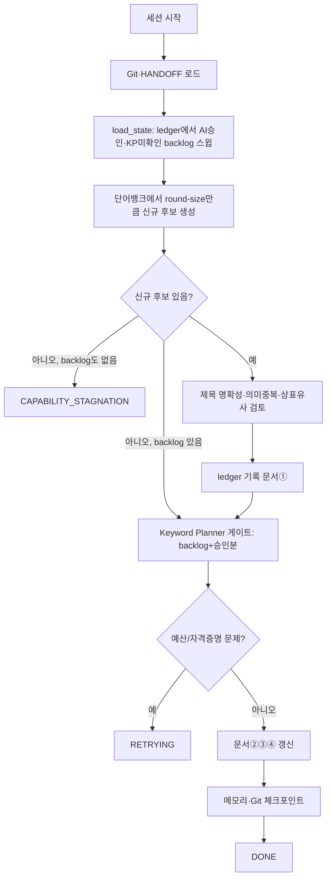

# 워크플로우·상태·영속 메모리

**목적:** 세션이 끊겨도 마지막 검증 배치부터 재개하고 토큰 낭비 없이 필요한 지식만 읽도록 한다.

## Claude Code 실행 지침
1. 표준 상태 외 임의 상태를 추가하지 않는다.
2. 세션 한계는 DONE이 아니라 PAUSED로 저장한다.
3. HANDOFF는 현재 상태와 다음 작업만 짧게 유지한다.
4. 재발 가능성·손상 위험·점수 오류·회귀 실패 등 의미 있는 문제만 개별 이슈로 기록한다.
5. 측정 가능한 개선과 QA가 없는 방법은 validated 플레이북 규칙으로 승격하지 않는다.

## 원본 설계 세부 규칙

> 원본 설계서의 §11(워크플로우) mermaid 다이어그램과 §13 읽기 순서는 수요/공급
> 파이프라인(2026-08-18 완전 삭제)과 "정확히 500/20개" 계약(같은 날 폐기) 기준으로
> 그려져 있었다. 원본은 `git log`(커밋 `d1ca668` 이후)로 확인 가능하며, 아래는
> 현재(2026-08-18 이후) 실제 실행되는 워크플로우로 교체했다.

# 11. 워크플로우와 상태 전이

표준 상태:

`RUNNING`, `RETRYING`, `CAPABILITY_STAGNATION`, `COMMIT_PENDING`, `RECOVERY_REQUIRED`, `PAUSED`, `FAILED`, `DONE`.

세션 한계는 `DONE`이 아니다. 현재 배치를 검증하고 인수인계·커밋·푸시 후 `PAUSED`로 저장한다.

---

# 13. 영속 메모리와 토큰 절약

## 12.1 세션 시작 읽기 순서

1. `CLAUDE.md`
2. `KNOWLEDGE_MANIFEST.yaml`
3. `HANDOFF.md`
4. `PROJECT_PLAYBOOK.md`
5. `ACTIVE_ISSUES.md`
6. 현재 Run 상태(`output/_pipeline/runs/<run_id>/run_state.json`)
7. `output/deliverables/history/generated_candidates.csv`/`keyword_metrics_passed.csv` 최근 상태

전체 `ACTIVITY_LOG.jsonl`은 매번 읽지 않는다. 필요한 Action ID 범위만 검색한다.

## 12.2 간소화 원칙

- `HANDOFF.md`는 현재 상태와 다음 작업만 짧게 유지
- 모든 정상 다운로드를 장문 이슈로 만들지 않음
- 반복 가능성이 있는 오류만 `/memory/issues/`에 기록
- 측정 가능한 개선이 확인된 규칙만 `/memory/lessons/`와 플레이북에 반영
- 원문 전체를 프롬프트에 넣지 않음
- 점수 하위 문제와 탈락 제목을 반복 검토하지 않음
- 리뷰 에이전트는 상위 기회와 최종 후보만 읽음

## 12.3 원자 작업 단위

토큰과 Git 커밋 수를 줄이기 위해 다음을 하나의 원자 작업으로 본다.

- 데이터원 하나의 증분 수집 배치
- 후보 문장 필터 배치
- 문제 추출 배치
- 문제 군집화 배치
- 수요 점수 배치
- 문제 하나의 공급 조사 배치
- 기회 검토 배치
- 제목 생성·검토 배치
- 최종 게시 배치
- QA 배치

배치 내부의 개별 파일 읽기나 데이터 한 행 처리는 별도 에이전트 호출이나 별도 커밋으로 만들지 않는다.

---

# 14. 이슈와 노하우

## 13.1 이슈 기록

다음 상황만 개별 이슈로 기록한다.

- 같은 오류가 재발할 가능성이 있음
- 데이터 손상 또는 누락 위험
- 점수 계산이나 중복 판정 오류
- 접근성 변경으로 핵심 데이터원이 중단됨
- 세션 재개 실패
- Git 충돌 또는 푸시 실패
- QA 회귀 실패
- 사용자 Google 검증에서 동일 산업의 공급 과소·과대 추정이 반복됨
- 입력된 Google 관측치가 기존 공급 등급을 크게 뒤집음

이슈 문서 필수 내용:

증상, 영향, 오류 시그니처, 시도, 실패 이유, 근본 원인, 최종 해결, 검증, 재발 방지, 수정 파일, 관련 커밋.

새 이슈 발생 시 과거 이슈를 먼저 검색한다.

## 13.2 노하우 기록

다음 조건을 모두 만족하는 경우에만 플레이북에 반영한다.

- 이전 방식과 비교됨
- 수요 탐지 정확도, 공급 누락률, 신규 기회 수, 제목 승인율 중 하나 이상 개선
- 다른 핵심 지표를 악화시키지 않음
- 독립 검토 또는 QA 통과
- 적용 조건과 금지 조건이 명확함

한 번 성공한 방법은 `candidate`이며, 검증 후에만 `validated`로 승격한다.

---
